# Finboard Platform — Complete System Flow Documentation

**Document:** `FLOW.md`  
**Version:** 1.0  
**Date:** 2026-06-26  
**Audience:** Engineers, architects, and technical onboarding  
**Status:** Authoritative flow guide aligned with repository implementation

---

## Table of Contents

1. [Introduction](#1-introduction)
2. [Business Workflow](#2-business-workflow)
3. [System Architecture](#3-system-architecture)
4. [Repository Structure](#4-repository-structure)
5. [Authentication Flow](#5-authentication-flow-current-implementation-only)
6. [User Profile Flow](#6-user-profile-flow)
7. [KYC Flow](#7-kyc-flow)
8. [OCR Flow](#8-ocr-flow)
9. [Banking Flow](#9-banking-flow)
10. [Investment Flow](#10-investment-flow)
11. [Notification Flow](#11-notification-flow)
12. [Audit Flow](#12-audit-flow)
13. [Database Architecture](#13-database-architecture)
14. [API Lifecycle](#14-api-lifecycle)
15. [Module Interaction](#15-module-interaction)
16. [End-to-End User Journey](#16-end-to-end-user-journey)
17. [Mermaid Diagrams Index](#17-mermaid-diagrams-index)
18. [Sequence Diagrams Index](#18-sequence-diagrams-index)
19. [Current vs Future](#19-current-vs-future)
20. [Developer Notes](#20-developer-notes)

---

# 1. Introduction

## 1.1 What This Project Is

**Finboard** is a full-stack fintech **simulation platform** for mutual fund investor onboarding, KYC verification, dummy core banking, and investment flows. It is built for **demo and learning purposes** — it does not connect to real banks, UPI, brokers, exchanges, or payment gateways.

The platform models how RTAs (Registrar & Transfer Agents) and AMCs (Asset Management Companies) onboard investors in India: identity capture, document verification, admin review, bank linking, and investment execution.

## 1.2 Why It Exists

| Problem | Finboard Response |
|---------|-------------------|
| KYC onboarding is multi-step and regulated | End-to-end KYC with PAN/Aadhaar, OCR, and admin review |
| Investors must link bank accounts before investing | Dummy core banking with Rs. 2 verification debit + refund |
| AMCs need order approval workflows | `amc_admin` role and pending MF order states |
| Engineers need a realistic reference architecture | Modular monolith today → microservices roadmap tomorrow |

## 1.3 Business Journey (One Paragraph)

A new user **registers** with phone OTP verification, **signs in**, completes an **extended profile**, submits **KYC** with PAN/Aadhaar documents, passes **OCR and seeded identity checks**, waits for **admin approval**, **verifies a bank account** (Rs. 2 debit refunded automatically), then **buys stocks or mutual funds** (SIP optional). Throughout the journey, **in-app notifications** inform the user of state changes, and **audit records** capture KYC lifecycle events for compliance simulation.

## 1.4 Responsibilities by Layer

| Layer | Responsibility |
|-------|----------------|
| **Frontend** (`frontend/`) | Next.js 16 App Router UI, auth session, TanStack Query data fetching, feature screens |
| **Backend** (`backend/`) | Single Express 5 app on port 4000; domain modules for auth, profile, KYC, banking, investments, notifications, audit |
| **MongoDB** | Users, profiles, KYC applications, notifications, audit logs, portfolio holdings |
| **PostgreSQL** | Banking accounts, transactions, ledger, verification, beneficiaries |
| **Local uploads** | KYC document files under `backend/uploads/kyc/` (interim; S3 planned) |

## 1.5 Module Responsibilities

| Module | Backend Location | Primary Responsibility |
|--------|------------------|------------------------|
| Authentication | `routes/authRoutes.js`, `controllers/authController.js` | JWT, signup, signin, OTP, admin login |
| Profile | `routes/profileRoutes.js`, `controllers/profileController.js` | Extended investor demographics |
| KYC | `kyc/` | Submit, review, approve/reject applications |
| OCR | `kyc/services/ocrService.js` | Tesseract + OpenRouter extraction |
| Banking | `banking/` | Prisma/PostgreSQL ledger, verification, transfers |
| Investments | `investments/routes/investmentRoutes.js` | Portfolio, buy, SIP, AMC admin |
| Notifications | `modules/notifications/` + `services/notification-service/` | MongoDB in-app notifications |
| Audit | `modules/audit/` + `services/audit-service/` | Append-only audit writes |

## 1.6 High-Level Architecture Diagram

```mermaid
flowchart TB
  subgraph Client["Browser — Next.js 16 :3000"]
    APP[App Router Pages]
    FEAT[features/* screens]
    CTX[AuthContext + TanStack Query]
    AXIOS[Axios Client + Bearer JWT]
  end

  subgraph Server["Express Monolith — :4000"]
    AUTH[/api/auth]
    PROF[/api/profile]
    KYC[/api/kyc + notifications + audit helpers]
    BANK[/api/banking]
    INV[/api/investments]
    MW[helmet · cors · rate-limit · sanitize · validate]
  end

  subgraph Data["Persistence"]
    MONGO[(MongoDB — Mongoose)]
    PG[(PostgreSQL — Prisma)]
    DISK[uploads/kyc/]
  end

  APP --> FEAT --> CTX --> AXIOS
  AXIOS --> MW --> AUTH & PROF & KYC & BANK & INV
  AUTH & PROF & KYC & INV --> MONGO
  KYC --> DISK
  BANK --> PG
  INV --> PG
  INV --> MONGO
```

### Notes

- All API traffic hits **one process** (`backend/src/server.js` → `app.js`).
- Cross-module calls are **direct JavaScript imports**, not HTTP or Kafka (today).
- Production target is microservices + Kafka — see §3.2 and §19.

---

# 2. Business Workflow

## 2.1 Investor Lifecycle (Business View)

```text
Prospective Investor
        │
        ▼
   Registration (+ Phone OTP)
        │
        ▼
   Authentication (Email/Password or Phone OTP)
        │
        ▼
   Profile Completion (demographics, address)
        │
        ▼
   KYC Submission (PAN + Aadhaar + documents)
        │
        ▼
   Automated Checks (OCR + seeded identity dataset)
        │
        ├── Fail ──► Rejection notification ──► Re-submit
        │
        ▼ Pass (pending admin)
   Admin / RTA Review
        │
        ├── Reject ──► Notification + profile.kycStatus = rejected
        │
        ▼ Approve
   Bank Account Verification (Rs. 2 debit → refund)
        │
        ▼
   Investment Eligibility Unlocked
        │
        ├── Buy Stock (immediate)
        ├── Buy Mutual Fund (pending AMC approval)
        └── Start SIP (first installment debited)
        │
        ▼
   Portfolio + Notifications + Audit Trail
```

## 2.2 Stage-by-Stage Business Explanation

### Registration

**Purpose:** Establish a unique identity with verified phone number before account creation.  
**Business rule:** Email and phone must be unique; password minimum 8 characters.  
**Outcome:** User record + empty profile + JWT session.

### Authentication (Return Visits)

**Purpose:** Re-establish identity without re-registration.  
**Paths:** Email/password (primary) or phone OTP (passwordless).  
**Outcome:** JWT valid for 7 days (configurable via `JWT_EXPIRES_IN`).

### Profile Completion

**Purpose:** Collect investor demographics required for regulatory-style onboarding forms.  
**Outcome:** `UserProfile` document linked to `User`; tracks `kycStatus`.

### KYC

**Purpose:** Verify identity against PAN and Aadhaar — core regulatory requirement for MF investing in India.  
**Why PAN:** Permanent Account Number is the tax identity anchor.  
**Why Aadhaar:** Universal identity document; last-mile verification in real systems.  
**Why OCR:** Reduces manual data entry errors; flags document vs typed mismatches.  
**Why admin approval:** Simulates RTA/AMC human review queue.  
**Outcome:** `KycApplication` with status `pending_admin_review`, `failed`, `approved`, or `rejected`.

### Bank Verification

**Purpose:** Confirm the investor controls a bank account before debiting investment amounts.  
**Business simulation:** Rs. 2 micro-debit (industry pattern) with automatic refund.  
**Outcome:** `BankAccount.appUserId` linked; profile bank summary updated on frontend.

### Investment

**Purpose:** Execute demo trades after compliance gates pass.  
**Gates:** `UserProfile.kycStatus === "approved"` AND linked `BankAccount`.  
**Outcome:** `PortfolioHolding` in MongoDB; bank debit in PostgreSQL; notification to user.

### Notifications

**Purpose:** Keep the investor informed of async state changes (KYC result, bank verified, order placed).  
**Channels today:** In-app only (MongoDB `AppNotification` + PostgreSQL `BankNotification`).

### Audit

**Purpose:** Immutable record of who changed KYC state and when — compliance foundation.  
**Scope today:** KYC submit/approve/reject events written to `AuditLog`.

## 2.3 Admin / RTA / AMC Roles (Business View)

| Role | Business Function |
|------|-------------------|
| `user` | Retail investor |
| `admin` | Platform operator; full admin + banking admin |
| `rta_admin` | KYC review (Registrar & Transfer Agent simulation) |
| `amc_admin` | Mutual fund order approval (Asset Management Company simulation) |

## 2.4 Business Workflow Diagram

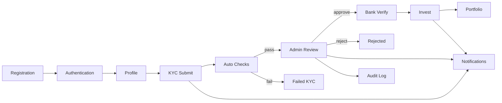

---

# 3. System Architecture

## 3.1 Current Architecture — Modular Monolith

### Why a Modular Monolith?

The team chose a **single deployable Express application** with **domain folders** (`kyc/`, `banking/`, `investments/`) to:

| Advantage | Explanation |
|-----------|-------------|
| Fast MVP delivery | No network hops, no service discovery, one `pnpm run dev` |
| Shared middleware | One `requireAuth`, one error handler, one rate limiter |
| Easier local debugging | Single process, single stack trace |
| Clear extraction path | Each folder maps 1:1 to a future microservice |

| Limitation | Explanation |
|------------|-------------|
| No independent scaling | KYC OCR load affects banking API latency in same process |
| Shared fate | One unhandled exception can crash all modules |
| No event replay | Notifications/audit are synchronous function calls |
| Single MongoDB connection | Not per-service database isolation yet |

### Current Component Map

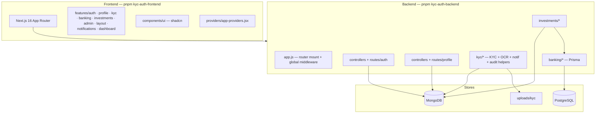

### Global Backend Middleware Stack (Order Matters)

Applied in `backend/src/app.js`:

| Order | Middleware | Purpose |
|-------|------------|---------|
| 1 | `helmet()` | Security headers |
| 2 | `cors()` | Whitelist `CLIENT_ORIGIN` |
| 3 | `express.json({ limit: "1mb" })` | JSON body parsing |
| 4 | `express.static("/uploads")` | Serve KYC files (demo) |
| 5 | `sanitizeRequest` | Strip `$`/`{}` from body (NoSQL injection mitigation) |
| 6 | `morgan` | Request logging |
| 7 | `rateLimit` | 100 requests per 15 minutes per IP |
| 8 | Route handlers | Domain routers |
| 9 | `notFound` | 404 JSON |
| 10 | `errorHandler` | Centralized error JSON |

## 3.2 Future Production Architecture — Microservices

> **Planned for Future Implementation** — described in `PRD.md` v2.0 and `IMPLEMENTATION-PLAN.md` Phase 10.

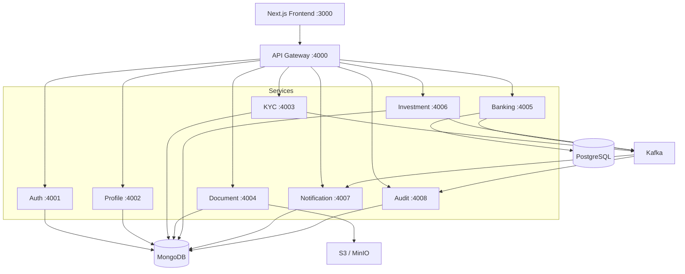

### Target Infrastructure

| Component | Role |
|-----------|------|
| **API Gateway** | Reverse proxy, rate limit, CORS, route to services |
| **Kafka** | `kyc.submitted`, `kyc.approved`, `kyc.rejected`, `bank.verified`, `order.placed` |
| **Docker Compose** | Local multi-service orchestration |
| **Kubernetes** | **Planned for Future Implementation** — post-MVP production scale |
| **S3 / MinIO** | Document storage with presigned URLs |

### Migration Strategy (Strangler Fig)

Extract modules from `backend/src/{domain}/` into `services/{domain}-service/` one at a time. Gateway routes extracted paths to new services; remaining paths stay on monolith until complete.

---

# 4. Repository Structure

## 4.1 Root

| Path | Purpose |
|------|---------|
| `packages/shared/` | Shared Express factory, JWT middleware, Mongo helpers (`@finboard/shared`) |
| `packages/contracts/` | Inter-service HTTP clients + Kafka topic constants (`@finboard/contracts`) |
| `services/` | Independently deployable microservices (see `services/README.md`) |
| `services/api-gateway/` | Reverse proxy :4000 — strangler routing to services/monolith |
| `services/notification-service/` | In-app notifications :4007 (extracted) |
| `services/audit-service/` | Immutable audit writes :4008 (extracted) |
| `MICROSERVICES-PLAN.md` | Phase M0–M8 extraction roadmap |
| `pnpm-workspace.yaml` | Declares `frontend` and `backend` packages |
| `PRD.md` | Product requirements v2.0 |
| `IMPLEMENTATION-PLAN.md` | Phase roadmap with completion status |
| `TECH-STACK.md` | Technology decisions |
| `FLOW.md` | This document |
| `result.md` | Architectural audit snapshot |
| `DOCS/` | Duplicate planning doc copies |
| `README.md` | Developer setup guide |

## 4.2 Backend — `backend/`

| Path | Purpose | Key Files | Interacts With |
|------|---------|-----------|----------------|
| `src/app.js` | Express app assembly | Route mounts, middleware | All modules |
| `src/server.js` | HTTP listener, graceful shutdown, refund job start | `connectDb()`, `SIGTERM` | MongoDB, banking job |
| `src/routes/` | Top-level routers | `authRoutes.js`, `profileRoutes.js` | controllers, middleware |
| `src/controllers/` | Auth + profile handlers | `authController.js`, `profileController.js` | models, services |
| `src/models/` | Mongoose schemas | `User.js`, `UserProfile.js`, `KycApplication.js`, etc. | MongoDB |
| `src/middleware/` | Cross-cutting | `auth.js`, `validate.js`, `sanitize.js`, `errorHandler.js` | All protected routes |
| `src/schemas/` | Zod validation | `authSchemas.js`, `profileSchemas.js` | validate middleware |
| `src/services/` | Shared services | `otpService.js` | auth controller |
| `src/utils/` | Helpers | `jwt.js` | auth |
| `src/config/` | Environment | `env.js`, `db.js` | startup |
| `src/auth/` | Admin seed | `seedAdminUser.js` | CLI seed |
| `src/kyc/` | KYC domain | controllers, routes, services, middleware, schemas | MongoDB, uploads, audit, notifications |
| `src/banking/` | Banking domain | routes, controllers, services, prisma, jobs | PostgreSQL |
| `src/investments/` | Investment domain | `investmentRoutes.js` | MongoDB, banking service, notifications |
| `prisma/` | PostgreSQL schema | `schema.prisma`, migrations, `seed.js` | Banking only |
| `uploads/kyc/` | Uploaded KYC files | Created at runtime by Multer | Static serve |

## 4.3 Frontend — `frontend/`

| Path | Purpose | Key Files | Interacts With |
|------|---------|-----------|----------------|
| `src/app/` | Next.js routes (thin pages) | `(auth)/`, `(platform)/`, `admin/` | feature screens |
| `src/features/` | Domain UI + API modules | `auth/`, `kyc/`, `banking/`, etc. | backend API |
| `src/components/ui/` | shadcn/ui primitives | Button, Card, Dialog, … | all features |
| `src/lib/api/` | Axios client | `client.js` | all API calls |
| `src/providers/` | React providers | `app-providers.jsx` | QueryClient, Theme, Auth |
| `src/hooks/` | Shared hooks | `use-mobile.js` | layout |

### Feature Module Pattern

Each feature typically contains:

```text
features/{name}/
  api/{name}-api.js    # API functions
  screens/*-screen.jsx # Page-level UI
  components/          # Feature-specific components
  index.js             # Barrel exports
```

## 4.4 Why Folders Exist (Design Intent)

| Decision | Rationale |
|----------|-----------|
| `backend/src/kyc/` owns notifications + audit helpers | Historical merge for MVP speed; Phase 10 extracts to separate services |
| `frontend/src/app/` is thin | App Router pages only import feature screens — separation of routing vs logic |
| `prisma/` at backend root | Banking is the only PostgreSQL consumer today |
| No `services/` directory yet | **Updated:** `services/` exists; notification + audit extracted; auth/kyc/banking pending Phase M2–M6 |

---

# 5. Authentication Flow (Current Implementation Only)

> This section documents **exactly what is implemented**. No hypothetical redesign.

## 5.1 Technology Stack (Auth)

| Component | Implementation |
|-----------|----------------|
| Token | JWT (`jsonwebtoken`) |
| Password | bcryptjs, 12 salt rounds |
| Phone OTP | Twilio Verify / Twilio Messages / in-memory dev store |
| Session (frontend) | React Context + `localStorage` key `kyc_auth_session` |
| HTTP auth | Axios `Authorization: Bearer <token>` |
| User store | MongoDB `User` collection |

## 5.2 Signup Flow

### Purpose

Create a new retail investor account with **verified phone number** before persisting credentials.

### Frontend Flow (`features/auth/screens/signup-screen.jsx`)

| Step | UI Action | API Call |
|------|-----------|----------|
| 1 | User fills name, email, phone (`+91...`), password | — |
| 2 | Click "Send OTP" | `POST /api/auth/send-otp` `{ phone }` |
| 3 | Enter OTP; optional "Verify" | `POST /api/auth/verify-otp` `{ phone, otp }` |
| 4 | Submit form | `POST /api/auth/signup` `{ name, email, phone, password, otp }` |
| 5 | Success | `login({ token, user })` → redirect `/dashboard` |

**Dev convenience:** If API returns `devOtp`, UI auto-fills OTP field.

### Backend Flow (`authController.signup`)

| Step | Function / Module | Action |
|------|-----------------|--------|
| 1 | `validate(signupSchema)` | Zod: name, email, phone, password (min 8), otp |
| 2 | `verifyPhoneOtp(phone, otp)` | Re-validates OTP (must pass) |
| 3 | `User.findOne({ $or: [email, phone] })` | Duplicate check → 409 |
| 4 | `new User({...}).setPassword(password)` | bcrypt hash |
| 5 | `user.save()` | MongoDB insert, `phoneVerified: true` |
| 6 | `UserProfile.create({ userId, fullName, mobileNumber, emailAddress })` | Profile bootstrap |
| 7 | `signJwt(user)` | JWT with `{ sub, email, role }` |
| 8 | Response | `201 { token, user: toSafeJSON() }` |

### OTP Send Flow (`otpService.sendPhoneOtp`)

Priority order:

1. **Twilio Verify** configured → SMS via Verify API  
2. **Twilio Messages** configured → generate OTP, SMS body  
3. **Development fallback** → in-memory `otpStore`, console log, optional `devOtp` in response

### Signup Sequence Diagram

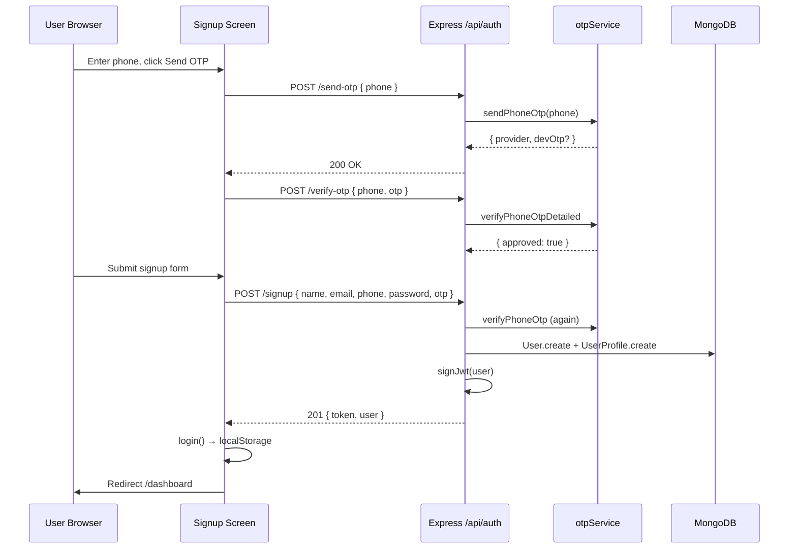

## 5.3 Customer Signin

### Email + Password (`signin-screen.jsx` → `authController.signin`)

| Step | Detail |
|------|--------|
| 1 | `POST /api/auth/signin` `{ email, password }` |
| 2 | `User.findOne({ email }).select("+passwordHash")` |
| 3 | `user.comparePassword(password)` — bcrypt |
| 4 | Update `lastLoginAt` |
| 5 | Return `{ token, user }` |
| 6 | Frontend `login()` + redirect `/dashboard` |

### Phone OTP Login (`signin-screen.jsx` → `authController.phoneLogin`)

| Step | Detail |
|------|--------|
| 1 | Send + verify OTP (same as signup) |
| 2 | `POST /api/auth/phone-login` `{ phone, otp }` |
| 3 | `verifyPhoneOtp` → find user by phone |
| 4 | If no user → 404 |
| 5 | Set `phoneVerified: true`, `lastLoginAt` |
| 6 | Return JWT |

### Signin Sequence (Email + Password)

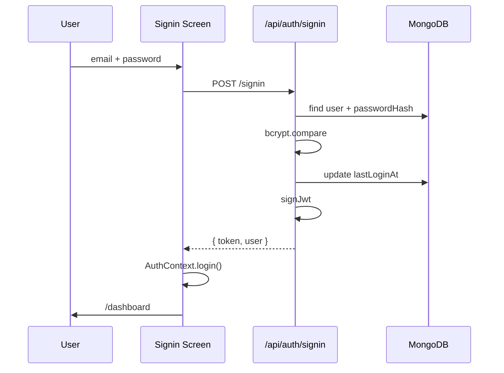

## 5.4 Admin Login

### Frontend (`features/auth/screens/admin-login-screen.jsx`)

| Field | Purpose |
|-------|---------|
| `email`, `password` | Admin credentials |
| `adminRole` | Selected role: `admin`, `rta_admin`, or `amc_admin` |

`POST /api/auth/admin/signin` → on success:

| User Role | Redirect |
|-----------|----------|
| `amc_admin` | `/admin/amc` |
| Other admin roles | `/admin/dashboard` |

### Backend (`authController.adminSignin`)

| Check | Failure |
|-------|---------|
| Valid email + password | 401 |
| `user.role` in `admin`, `rta_admin`, `amc_admin` | 403 |
| If `adminRole` provided and ≠ `admin`, must match `user.role` | 403 |

### Admin Authorization After Login

Protected admin pages wrap `ProtectedRoute` with `requiredRole`. Backend routes use `requireRole("admin", "rta_admin")` or similar per endpoint.

## 5.5 JWT Lifecycle

### Generation (`utils/jwt.js` → `signJwt`)

```javascript
jwt.sign(
  { sub: user._id.toString(), email: user.email, role: user.role },
  env.jwtSecret,
  { expiresIn: env.jwtExpiresIn }  // default "7d"
)
```

### Validation (`middleware/auth.js` → `requireAuth`)

| Step | Action |
|------|--------|
| 1 | Parse `Authorization: Bearer <token>` |
| 2 | `verifyJwt(token)` — throws if expired/invalid |
| 3 | `User.findById(payload.sub)` |
| 4 | Attach `req.user` |
| 5 | Call `next()` |

### Role Middleware

| Function | Allows |
|----------|--------|
| `requireAdmin` | `admin`, `rta_admin`, `amc_admin` |
| `requireRole(...roles)` | Exact role list per route |

### JWT Validation Sequence

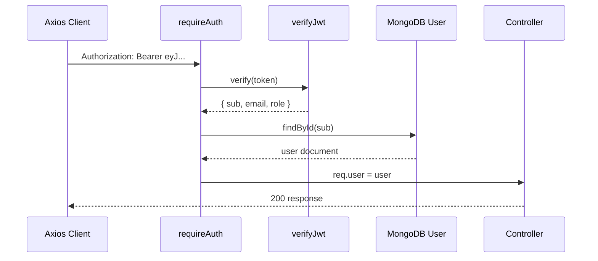

## 5.6 Session Lifecycle (Frontend)

### AuthProvider (`features/auth/context/auth-context.jsx`)

| Method | Behavior |
|--------|----------|
| **Init** | Read `localStorage.kyc_auth_session` → restore token + user → `setAuthToken(token)` |
| **`login(session)`** | Set state + localStorage + Axios header |
| **`refreshMe()`** | `GET /api/auth/me` → update user in state + localStorage |
| **`logout()`** | Clear state, localStorage, Axios header |

### ProtectedRoute (`features/auth/components/protected-route.jsx`)

| Condition | Action |
|-----------|--------|
| `!ready` | Show skeleton |
| `!token` | Redirect `/signin` or `/admin/login` |
| Wrong `requiredRole` | Redirect `/dashboard` |
| OK | Render children |

### DashboardGate

If an admin-role user lands on `/dashboard`, redirect to appropriate admin home.

## 5.7 Auth API Reference (Implemented)

| Method | Path | Auth | Handler |
|--------|------|------|---------|
| POST | `/api/auth/send-otp` | No | `sendOtp` |
| POST | `/api/auth/verify-otp` | No | `verifyOtp` |
| POST | `/api/auth/signup` | No | `signup` |
| POST | `/api/auth/signin` | No | `signin` |
| POST | `/api/auth/admin/signin` | No | `adminSignin` |
| POST | `/api/auth/phone-login` | No | `phoneLogin` |
| GET | `/api/auth/me` | JWT | `me` |
| PATCH | `/api/auth/change-password` | JWT | `changePassword` |

## 5.8 Current Limitations (Explicit)

| Limitation | Detail |
|------------|--------|
| **No refresh tokens** | Single JWT until expiry; user must re-login |
| **No HttpOnly cookies** | Token in `localStorage` — XSS-readable |
| **Phone OTP authentication** | Twilio + dev fallback (`TWILIO_DEV_OTP`) |
| **No email password reset** | Only `change-password` while authenticated |
| **JWT in localStorage** | Client-side persistence; not secure against XSS |
| **OTP store in-memory** | Dev OTP lost on server restart (Twilio paths unaffected) |

---

# 6. User Profile Flow

## 6.1 Purpose

Store extended investor information beyond the auth `User` record and track **`kycStatus`** as the onboarding gate for investments.

## 6.2 Profile Creation

| Trigger | Mechanism |
|---------|-----------|
| Signup | `UserProfile.create()` in `authController.signup` |
| First GET | `getProfile` upserts with `$setOnInsert` from `req.user` |

## 6.3 Retrieval — `GET /api/profile/me`

| Step | Code | Detail |
|------|------|--------|
| 1 | `requireAuth` | JWT required |
| 2 | `UserProfile.findOneAndUpdate({ userId }, { $setOnInsert: {...} }, { upsert: true })` | Creates if missing |
| 3 | Response | `{ profile }` |

## 6.4 Update — `PUT /api/profile/me`

| Step | Code | Detail |
|------|------|--------|
| 1 | `validate(profileUpdateSchema)` | Zod validation |
| 2 | Normalize `dateOfBirth`, uppercase `pan` and `bank.ifsc` |
| 3 | `findOneAndUpdate({ userId }, { $set: data }, { upsert: true, runValidators: true })` |
| 4 | Response | `{ profile }` |

## 6.5 KYC Status Sync

Profile `kycStatus` is updated by:

| Event | New Status | Updater |
|-------|------------|---------|
| KYC submit (pass checks) | `pending_review` | `kycController.submitKyc` |
| KYC submit (fail checks) | `rejected` | `kycController.submitKyc` |
| Admin approve | `approved` | `kycController.approveKyc` |
| Admin reject | `rejected` | `kycController.rejectKyc` |

## 6.6 Frontend

Route: `/profile` → `features/profile/screens/profile-screen.jsx`  
API: `features/profile` via TanStack Query mutations.

## 6.7 Profile Flow Diagram

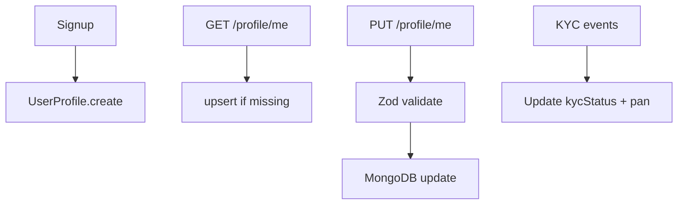

---

# 7. KYC Flow

## 7.1 Purpose and Business Rules

| Question | Answer |
|----------|--------|
| Why KYC exists? | Regulatory requirement before MF/stock investing |
| Why PAN? | Tax identity; 10-char permanent account number |
| Why Aadhaar? | Universal ID verification |
| Why OCR? | Extract typed values from uploaded images for mismatch detection |
| Why admin approval? | Human review simulates RTA/AMC compliance queue |
| Why dummy identity dataset? | Demo environment validates against seeded `DummyIdentity` records |

## 7.2 KYC Status State Machine

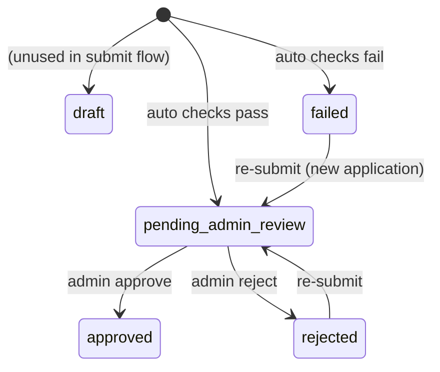

## 7.3 Submission Flow — Complete Lifecycle

### Frontend (`features/kyc/screens/kyc-screen.jsx`)

User provides: name, PAN, Aadhaar number, PAN file, Aadhaar file.  
Submits multipart form to `POST /api/kyc/submit`.

### Backend Pipeline (`kycController.submitKyc`)

| # | Stage | Detail |
|---|-------|--------|
| 1 | **Auth** | `requireAuth` on all `/api/kyc/*` routes |
| 2 | **Upload** | `kycUpload.fields([pan, aadhaar])` — Multer disk storage, max 5MB, PNG/JPG/WEBP/PDF |
| 3 | **Validation** | `submitKycSchema` — name, PAN regex, 12-digit Aadhaar |
| 4 | **Identity lookup** | `DummyIdentity.findOne({ panNumber, aadhaarNumber })` |
| 5 | **OCR** | Parallel `processDocument()` on both files — see §8 |
| 6 | **Demo fallback** | If OCR empty but identity found, inject seeded extraction |
| 7 | **Document assembly** | `fileToDocument()` — metadata + OCR + URL `/uploads/kyc/{file}` |
| 8 | **Match flags** | Compare extracted PAN/Aadhaar to user-entered values |
| 9 | **AI verification** | `verifyKycWithAi()` — Mistral vision compares user input, OCR output, and document images against seeded identity (ground truth); stores `aiVerification` scores |
| 10 | **Checks object** | `identityExists`, `nameMatchesDataset`, `panMatchesDataset`, `aadhaarMatchesDataset`, `panOcrMatches`, `aadhaarOcrMatches` |
| 11 | **Pass rule** | `canReview = identityExists` — identity found → `pending_admin_review`; missing → `failed`. AI score is advisory; admin approves/rejects manually |
| 12 | **Create application** | `KycApplication.create()` — status `pending_admin_review` or `failed` |
| 13 | **Update profile** | `UserProfile.kycStatus` → `pending_review` or `rejected` |
| 14 | **Notify** | `notifyUser()` — submission or failure message |
| 15 | **Audit** | `audit(req, "KYC_SUBMITTED", ...)` |
| 16 | **Response** | `201 { application }` |

## 7.4 Admin Review Flow

### List — `GET /api/kyc/admin/applications`

- Requires `requireRole("admin", "rta_admin")`
- Returns up to 100 applications, newest first
- Joins user data from `User` collection
- Documents summarized via `documentSummary()` (truncated OCR preview)

### Detail — `GET /api/kyc/admin/applications/:id`

Returns `{ application, user, identity, adminReview }` with side-by-side entered vs seeded vs OCR data and `aiVerification` accuracy scores.

### Approve — `POST .../approve`

| Side Effect | Detail |
|-------------|--------|
| `KycApplication.status` | `approved` |
| `UserProfile.kycStatus` | `approved` |
| Notification | "KYC Approved" |
| Audit | `KYC_APPROVED` |

### Reject — `POST .../reject`

Same pattern with `rejected` status and optional remarks in body.

## 7.5 Frontend Admin UI

`features/admin/kyc/screens/admin-kyc-screen.jsx`:

- Lists applications with status badges and AI accuracy score
- Inline detail panel with document URLs, OCR comparison, AI verification card, check pills
- Approve/reject with remarks textarea
- Uses TanStack Query mutations; invalidates on success

## 7.6 KYC API Reference

| Method | Path | Auth | Handler |
|--------|------|------|---------|
| GET | `/api/kyc/me` | JWT | `getMyKyc` |
| POST | `/api/kyc/submit` | JWT | `submitKyc` |
| GET | `/api/kyc/admin/applications` | admin, rta_admin | `listKycAdmin` |
| GET | `/api/kyc/admin/applications/:id` | admin, rta_admin | `getKycAdmin` |
| POST | `/api/kyc/admin/applications/:id/approve` | admin, rta_admin | `approveKyc` |
| POST | `/api/kyc/admin/applications/:id/reject` | admin, rta_admin | `rejectKyc` |

## 7.7 KYC Full Flow Diagram

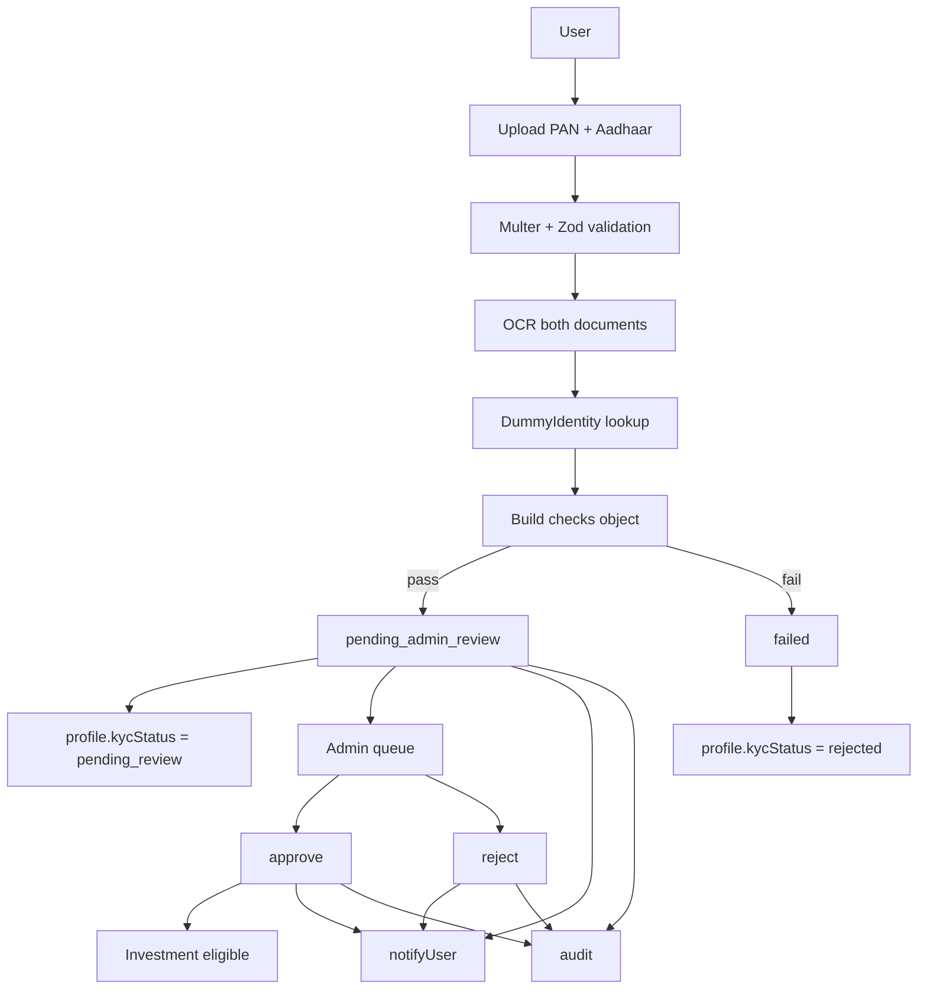

## 7.8 Future Improvements

> **Planned for Future Implementation**

- PAN checksum validation before accept
- S3 document storage + presigned admin view URLs
- Server-side pagination and status filters on admin list
- Mandatory rejection remarks
- Kafka `kyc.submitted` event
- Dedicated `/api/admin/*` path normalization

---

# 8. OCR Flow

## 8.1 Purpose

Extract machine-readable text and structured fields from uploaded identity documents to support automated mismatch detection and admin review.

## 8.2 Entry Point

`ocrService.processDocument(filePath, type)` where `type` is `"pan"` or `"aadhaar"`.

Called from `kycController.submitKyc` — **OCR is not a standalone API**; it runs inside KYC submission.

## 8.3 Processing Pipeline

| Stage | Function | Output |
|-------|----------|--------|
| 1. Tesseract OCR | `runTesseractOcr(filePath)` | Raw `ocrText` string |
| 2. Structured extraction | `extractWithOpenRouter(ocrText, type)` | `{ name, panNumber }` or `{ name, aadhaarNumber }` |
| 3. Fallback parsing | `parseFallback(ocrText, type)` | Regex-based field extraction if OpenRouter unavailable |
| 4. Return bundle | `processDocument` | `{ ocrText, extracted, extractionSource }` |

### Extraction Sources

| `extractionSource` | Meaning |
|--------------------|---------|
| `tesseract_openrouter` | Tesseract + OpenRouter LLM JSON |
| `tesseract_regex` | Tesseract + regex fallback only |
| `seeded_demo_fallback` | Injected from `DummyIdentity` when OCR empty |
| `ocr_error` | Tesseract threw; empty extraction |

## 8.4 OpenRouter Integration

When `OPENROUTER_API_KEY` is set:

- POST `https://openrouter.ai/api/v1/chat/completions`
- Model: `OPENROUTER_MODEL` (default `openai/gpt-4o-mini`)
- System prompt requests minified JSON with expected keys
- On failure → falls back to regex parsing

## 8.5 Field Detection (Regex Fallback)

| Document | Regex / Logic |
|----------|---------------|
| PAN number | `[A-Z]{5}[0-9]{4}[A-Z]` |
| Aadhaar | 12 digits (with optional spaces) |
| Name | First alphabetic line excluding government boilerplate |

## 8.6 Matching (KYC Controller)

After OCR:

```javascript
panDoc.match = extracted.panNumber === payload.panNumber
aadhaarDoc.match = extracted.aadhaarNumber === payload.aadhaarNumber
```

Stored in `checks.panOcrMatches` and `checks.aadhaarOcrMatches`.  
**Note:** Auto-pass rule uses **dataset matching**, not OCR matching.

## 8.7 Error Handling

| Failure | Behavior |
|---------|----------|
| Tesseract error | Empty ocrText, `extractionSource: "ocr_error"`, submission continues |
| OpenRouter error | Console warn, regex fallback |
| No OpenRouter key | Skip LLM, regex only |

## 8.8 OCR Sequence Diagram

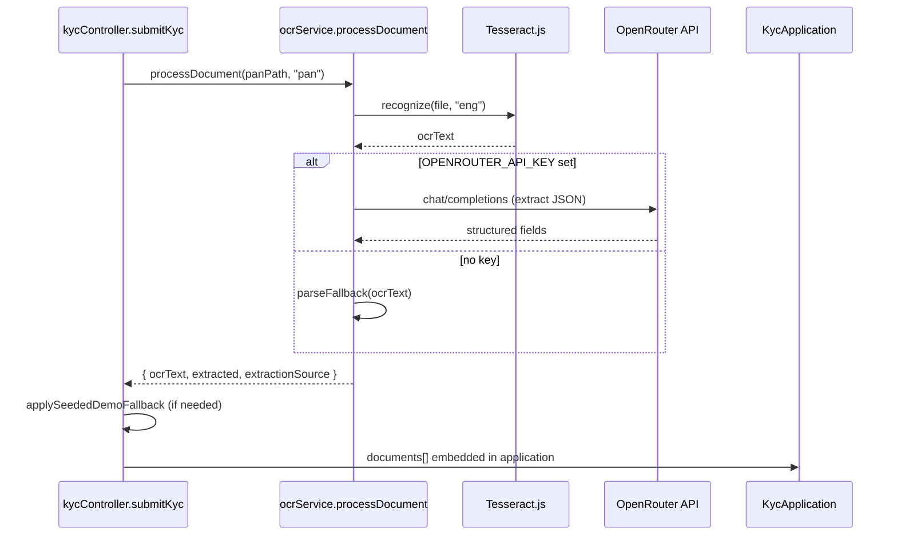

## 8.9 OCR ↔ KYC Boundary

| OCR Responsibility | KYC Responsibility |
|--------------------|-------------------|
| Read file from disk | Receive uploaded files via Multer |
| Extract text/fields | Validate PAN/Aadhaar format |
| Return extraction bundle | Match against DummyIdentity |
| — | Decide pass/fail status |
| — | Persist application, notify, audit |

---

# 9. Banking Flow

## 9.1 Purpose

Simulate core banking: account linking, Rs. 2 verification debit with refund, transfers, beneficiaries, and investment debits — all on **PostgreSQL via Prisma**.

## 9.2 Activation Gate

Banking routes use:

1. `requireAuth`
2. `requireBankingConfigured` — returns error if `BANK_DATABASE_URL` not set
3. **Role enforcement** via `requireRole`:
   - **Customer routes** (`/api/banking/*`, excluding `/admin/*`): `requireRole("user")` — retail investors only
   - **Admin routes** (`/api/banking/admin/*`): `requireRole("admin")` — KYC Review Admin and Operations Admin only

| Persona | JWT `role` | Customer banking | Banking admin |
|---------|------------|------------------|---------------|
| Retail investor | `user` | Yes | No |
| KYC / Operations Admin | `admin` | No | Yes |
| RTA Admin | `rta_admin` | No | No |
| AMC Manager | `amc_admin` | No | No |

If banking is not configured, `/api/banking/*` fails gracefully; rest of app works.

## 9.3 Bank Verification Flow (Rs. 2 Debit)

### API

`POST /api/banking/verify-bank` — body validated by `verifyBankSchema`.

### Business Logic (`bankingService.verifyBankAccount`)

Executed inside `prisma.$transaction`:

| Step | Action |
|------|--------|
| 1 | Find `BankAccount` by `accountNumber` + `ifsc` |
| 2 | Validate holder name matches (case-insensitive) |
| 3 | If invalid → create `BankVerification` status `INVALID`, throw 404 |
| 4 | If account `FROZEN` → 403 |
| 5 | If balance < Rs. 2 (`VERIFICATION_AMOUNT`) → notification + 400 |
| 6 | Decrement balance by Rs. 2 |
| 7 | Create `BankTransaction` type `DEBIT`, ref prefix `VRD` |
| 8 | Create `LedgerEntry` with `balanceAfter` |
| 9 | Create `BankVerification` status `REFUND_PENDING`, `refundDueAt = now + 45s` (configurable) |
| 10 | Link `appUserId` to account |
| 11 | Create `BankNotification` |

### Refund Scheduler (`banking/jobs/refundJob.js`)

| Property | Value |
|----------|-------|
| Interval | Every 30 seconds |
| Started | `server.js` on boot (if banking configured) |
| Stopped | On `SIGTERM` / `SIGINT` |

`processDueVerificationRefunds()`:

- Finds verifications where `status = REFUND_PENDING` and `refundDueAt <= now`
- Credits Rs. 2 back, creates `BankTransaction` type `CREDIT` ref `VRF`
- Updates verification to `REFUNDED`
- Sends refund notification

## 9.4 Transfers and Beneficiaries

| API | Service Function |
|-----|------------------|
| `POST /api/banking/transfer` | `transferFunds` — debit sender, credit receiver, ledger entries |
| `POST /api/banking/beneficiary` | `createBeneficiary` |
| `GET /api/banking/transactions` | Transaction history for linked account |

## 9.5 Investment Debit Integration

`debitForInvestment(appUserId, amount, description, targetAccount)`:

- Called from `investmentRoutes.js` before creating `PortfolioHolding`
- Debits user's linked `BankAccount` in PostgreSQL transaction
- Transaction ref prefix `INV`

## 9.6 PostgreSQL Tables (Prisma)

| Model | Purpose |
|-------|---------|
| `BankAccount` | Account holder, balance, `appUserId` link |
| `BankTransaction` | Debit/credit records |
| `LedgerEntry` | Double-entry style balance snapshot |
| `BankVerification` | Verification lifecycle (`REFUND_PENDING` → `REFUNDED`) |
| `Beneficiary` | Saved transfer targets |
| `BankNotification` | Banking-specific in-app notifications |

## 9.7 Banking Verification Sequence

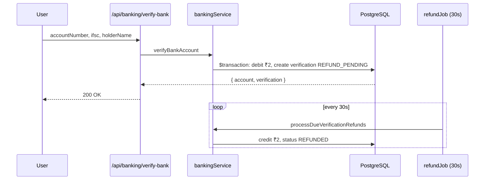

## 9.8 Frontend

Route: `/banking` → `features/banking/screens/banking-screen.jsx`  
API module: `features/banking/api/banking-api.js`

Admin banking: `/banking/admin` (requires `admin` JWT role on frontend + backend).

Customer banking: `/banking` (requires `user` JWT role — admins are redirected away).

---

# 10. Investment Flow

## 10.1 Purpose

Allow approved, bank-linked users to purchase stocks, mutual funds, and SIPs; AMC admins approve pending MF orders.

## 10.2 Eligibility Gate

`ensureInvestmentEligibility(userId)` in `investmentRoutes.js`:

| Check | Failure |
|-------|---------|
| `UserProfile.kycStatus === "approved"` | 403 "Complete KYC approval" |
| `getLinkedAccount(userId)` exists | 400 "Complete bank verification" |

## 10.3 Buy Stock / Mutual Fund — `POST /api/investments/buy`

| Step | Action |
|------|--------|
| 1 | `validate(buyStockSchema)` — symbol, name, price, quantity, optional `assetType` |
| 2 | `ensureInvestmentEligibility` |
| 3 | `totalAmount = price * quantity` |
| 4 | `debitForInvestment(userId, totalAmount, description, amcAccount)` |
| 5 | `PortfolioHolding.create()` in MongoDB |
| 6 | `orderStatus`: `successful` (stock) or `pending_amc_approval` (mutual_fund) |
| 7 | `notifyUser()` — purchase confirmation |
| 8 | `201 { holding }` |

Default AMC collection account is hardcoded in route (Finboard Asset Management Collection / HDFC).

## 10.4 SIP — `POST /api/investments/sip`

| Step | Action |
|------|--------|
| 1 | Validate monthly amount, NAV, sip date (1–28) |
| 2 | Eligibility + debit first installment |
| 3 | `assetType: "sip"`, `orderStatus: "sip_active"` |
| 4 | Compute `nextDebitDate` |
| 5 | Create holding + notification |

## 10.5 Portfolio — `GET /api/investments/portfolio`

Returns all `PortfolioHolding` for user, sorted by `createdAt` desc.

## 10.6 AMC Admin — `GET /api/investments/admin/overview`

Requires `requireRole("admin", "rta_admin", "amc_admin")`.

Returns AUM summary + enriched holdings with investor user data.

## 10.7 Order Status Update — `PATCH /api/investments/admin/orders/:id/status`

Requires `requireRole("admin", "amc_admin")`.

Allowed statuses: `successful`, `rejected`, `pending_amc_approval`, `sip_active`, `sip_paused`, `sip_stopped`.

## 10.8 Frontend

| Route | Screen |
|-------|--------|
| `/dashboard` | Market listings, portfolio summary (mock + API) |
| `/stocks/[symbol]` | Detail, buy, SIP |
| `/admin/amc` | AMC order management |

Market prices in `features/investments/data/market-data.js` are **client-side mock data** for demo UI.

## 10.9 Investment Purchase Sequence

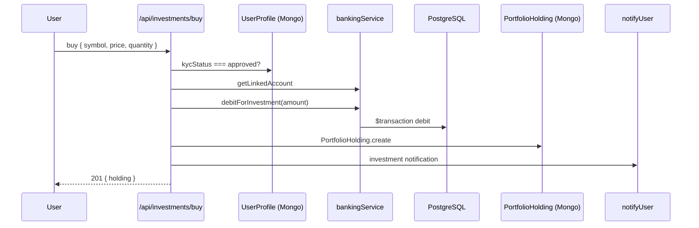

---

# 11. Notification Flow

## 11.1 Current Implementation — In-App Only

Two notification stores:

| Store | Collection/Table | Module | API |
|-------|------------------|--------|-----|
| App notifications | MongoDB `AppNotification` | KYC module | `/api/notifications` |
| Bank notifications | PostgreSQL `BankNotification` | Banking module | `/api/banking/notifications` |

## 11.2 App Notification Trigger Points

| Event | Title (example) | Caller |
|-------|-----------------|--------|
| KYC submitted (pass) | "KYC Submitted" | `kycController.submitKyc` |
| KYC failed checks | "KYC Failed" | `kycController.submitKyc` |
| KYC approved | "KYC Approved" | `kycController.approveKyc` |
| KYC rejected | "KYC Rejected" | `kycController.rejectKyc` |
| Stock/MF purchase | "Stock Purchased" / "Mutual Fund Order Placed" | `investmentRoutes` |
| SIP created | "SIP Created" | `investmentRoutes` |
| Order status change | "Investment Order Updated" | `investmentRoutes` PATCH |

### Creation (`appNotificationService.notifyUser`)

```javascript
AppNotification.create({ userId, title, message, type })
```

Synchronous — no queue.

## 11.3 App Notification API

| Method | Path | Action |
|--------|------|--------|
| GET | `/api/notifications` | List last 50 for user |
| DELETE | `/api/notifications/:id` | Delete if owned by user |

> **Planned for Future Implementation:** `PUT /:id/read`, `GET /unread-count`, email via nodemailer.

## 11.4 Frontend Rendering

`navbar.jsx`:

- Polls app notifications (`notificationApi.app`) and bank notifications (`bankingApi.notifications`) every 15s
- Merges into single list with `source: "app" | "banking"`
- Unread count computed client-side: `!item.read`
- Dismiss calls DELETE on appropriate API

## 11.5 Future Kafka Implementation

> **Planned for Future Implementation**

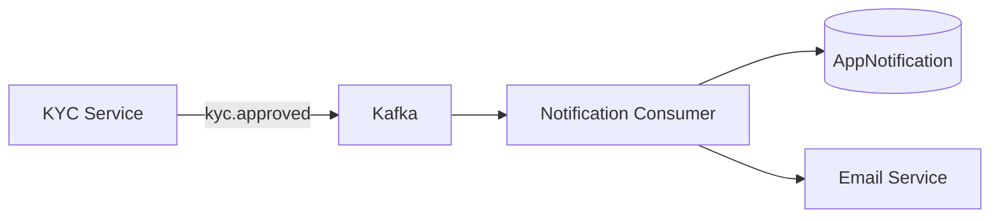

Topics: `kyc.submitted`, `kyc.approved`, `kyc.rejected`, `bank.verified`, `order.placed`.

---

# 12. Audit Flow

## 12.1 Purpose

Record **who** performed **what action** on **which resource**, with request context — foundation for compliance audit trails.

## 12.2 Current Implementation — Write-Only

### Trigger

`audit(req, action, resourceType, resourceId, details)` in `kyc/services/auditService.js`.

Called synchronously from `kycController` on:

| Action | Constant |
|--------|----------|
| KYC submission | `KYC_SUBMITTED` |
| KYC approval | `KYC_APPROVED` |
| KYC rejection | `KYC_REJECTED` |

### Record Shape (`AuditLog` model)

| Field | Source |
|-------|--------|
| `actorId` | `req.user._id` |
| `actorRole` | `req.user.role` |
| `action` | Parameter |
| `resourceType` | `"kyc"` |
| `resourceId` | Application ID |
| `details` | e.g. `{ status, checks }` or `{ remarks }` |
| `ipAddress` | `req.ip` |
| `userAgent` | `req.headers["user-agent"]` |

### Storage

MongoDB `AuditLog` collection — append via `AuditLog.create()`.

**No read API exists today.**

> **Planned for Future Implementation:** `GET /api/audit/:resourceType/:resourceId`, Kafka consumer for all lifecycle events, admin audit UI.

## 12.3 Audit Sequence (KYC Approve)

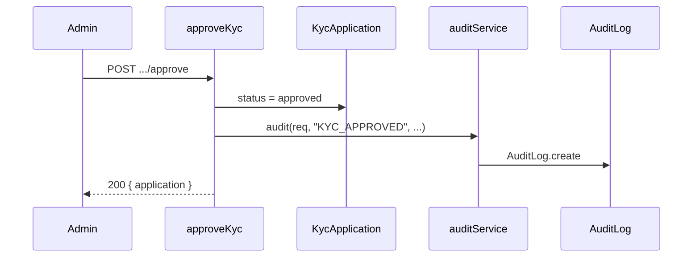

---

# 13. Database Architecture

## 13.1 Hybrid Persistence Overview

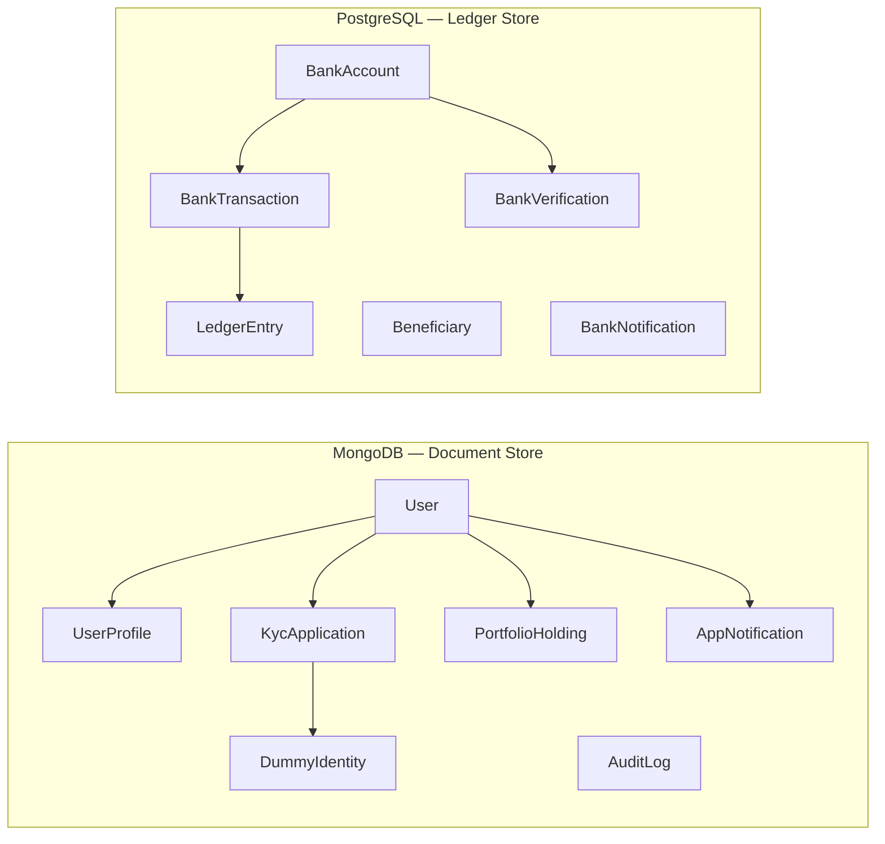

## 13.2 MongoDB Collections

### User

| Field | Notes |
|-------|-------|
| `email`, `phone` | Unique indexed |
| `passwordHash` | bcrypt, `select: false` |
| `role` | `user`, `admin`, `rta_admin`, `amc_admin` |
| `phoneVerified` | Set true on signup / phone login |

**Owner module:** Authentication  
**Read/write:** Auth controllers, `requireAuth` lookup

### UserProfile

| Field | Notes |
|-------|-------|
| `userId` | Unique ref to User |
| `kycStatus` | Onboarding gate for investments |
| `pan`, `address`, `bank` | Nested subdocuments |

**Owner:** Profile / KYC (status updates)  
**Relationship:** 1:1 with User

### KycApplication

| Field | Notes |
|-------|-------|
| `userId` | Applicant |
| `documents[]` | Embedded upload metadata + OCR |
| `checks` | Boolean validation flags |
| `status` | Lifecycle state |
| `dummyIdentityId` | Ref to matched seed record |

**Owner:** KYC module

### DummyIdentity

Seeded test identities for demo KYC matching (`seed:kyc` script).

### AppNotification

| Field | Notes |
|-------|-------|
| `userId` | Indexed |
| `read` | Default false (not updated via API today) |

### AuditLog

Append-only writes from `auditService`. No delete/update routes.

### PortfolioHolding

Investment positions; references `userId`. Contains `assetType`, `orderStatus`, SIP fields, `amcAccount` metadata.

## 13.3 PostgreSQL Tables (Prisma)

### BankAccount

Central entity. `appUserId` links MongoDB user ID (string) to bank account. `balance` is `Decimal(14,2)`.

### BankTransaction

Records all debits/credits with `transactionRef`, optional sender/receiver account IDs.

### LedgerEntry

Per-transaction balance snapshot (`balanceAfter`) for audit-style ledger trail.

### BankVerification

Tracks verification attempts and refund lifecycle (`REFUND_PENDING` → `REFUNDED`).

### Why PostgreSQL Only for Banking?

| Requirement | Why PostgreSQL |
|-------------|----------------|
| ACID transactions | Multi-step debit + ledger must be atomic |
| Decimal precision | Money cannot use floating point |
| Relational integrity | Account → Transaction → Ledger FK chain |
| Isolation | Banking ledger separate from document-oriented KYC data |

---

# 14. API Lifecycle

## 14.1 Request Path (Detailed)

```text
Browser
  │
  ▼
React Client Component (feature screen)
  │
  ▼
TanStack Query / direct api.post/get
  │
  ▼
Axios (lib/api/client.js)
  │  — baseURL: NEXT_PUBLIC_API_URL
  │  — Authorization: Bearer JWT (if logged in)
  ▼
Express Global Middleware
  │  helmet → cors → json → static → sanitize → morgan → rateLimit
  ▼
Route Router (e.g. kycRouter)
  │  requireAuth → requireRole → validate(schema)
  ▼
Controller Function
  │  Business logic, orchestration
  ▼
Service Layer (optional)
  │  ocrService, bankingService, otpService, audit, notifyUser
  ▼
Database
  │  Mongoose or Prisma
  ▼
Response JSON
  │
  ▼
TanStack Query cache update / invalidation
  │
  ▼
UI re-render (Sonner toast on mutation)
```

## 14.2 Validation Strategy

All POST/PATCH/PUT bodies pass through Zod schemas via `validate()` middleware.

Failure response:

```json
{
  "message": "Validation failed",
  "issues": [{ "path": "panNumber", "message": "..." }]
}
```

Frontend `getApiError()` surfaces these messages in toasts.

## 14.3 Error Handling

`errorHandler` middleware:

| Condition | Status | Message |
|-----------|--------|---------|
| `error.statusCode` set | That code | `error.message` |
| Unknown error | 500 | "Something went wrong" |

Banking/investment services throw errors with `statusCode` via `Object.assign(new Error(...), { statusCode: 400 })`.

## 14.4 API Lifecycle Diagram

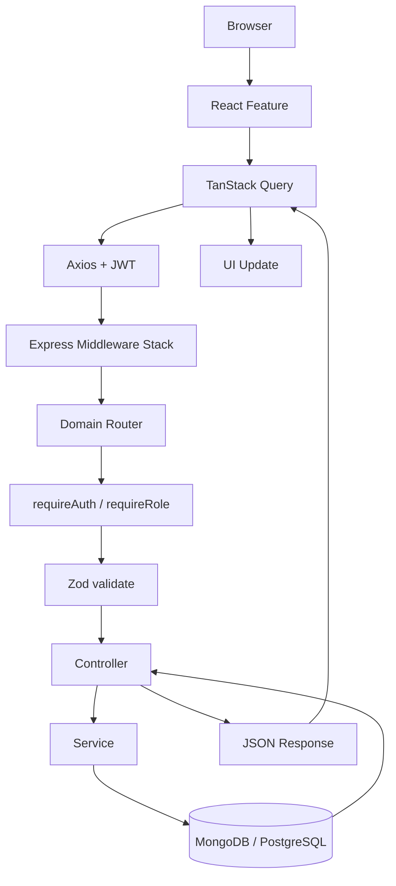

---

# 15. Module Interaction

## 15.1 Current — Direct Imports

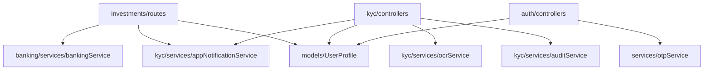

| From | To | Call Type |
|------|-----|-----------|
| Investments | Banking | `debitForInvestment`, `getLinkedAccount` |
| Investments | Notifications | `notifyUser` |
| KYC | OCR | `processDocument` |
| KYC | Notifications | `notifyUser` |
| KYC | Audit | `audit` |
| KYC | Profile | `UserProfile.findOneAndUpdate` |
| Auth | Profile | `UserProfile.create` on signup |

## 15.2 Shared Utilities

| Utility | Location | Used By |
|---------|----------|---------|
| `requireAuth` | `middleware/auth.js` | All protected routes |
| `validate` | `middleware/validate.js` | POST/PATCH bodies |
| `signJwt` / `verifyJwt` | `utils/jwt.js` | Auth |
| `env` | `config/env.js` | All modules |

## 15.3 Future — HTTP + Kafka

> **Planned for Future Implementation**

| From | To | Mechanism |
|------|-----|-----------|
| KYC Service | Notification Service | Kafka `kyc.approved` |
| KYC Service | Audit Service | Kafka `kyc.submitted` |
| Investment Service | Banking Service | HTTP `POST /internal/debit` |
| Gateway | All services | HTTP proxy |

## 15.4 Module Ownership

| Domain | Owns Data | Owns Routes |
|--------|-----------|-------------|
| Auth | User | `/api/auth/*` |
| Profile | UserProfile | `/api/profile/*` |
| KYC | KycApplication, DummyIdentity | `/api/kyc/*` |
| Notifications | AppNotification | `/api/notifications/*` |
| Audit | AuditLog | (no public routes) |
| Banking | All Prisma models | `/api/banking/*` |
| Investments | PortfolioHolding | `/api/investments/*` |

---

# 16. End-to-End User Journey

## 16.1 Complete Lifecycle Table

| Step | Frontend | API | Controller/Service | Database | Response |
|------|----------|-----|-------------------|----------|----------|
| **Signup** | `signup-screen` | POST `/auth/signup` | `authController.signup`, `otpService` | User + UserProfile insert | JWT |
| **Login** | `signin-screen` | POST `/auth/signin` | bcrypt verify | User read/update | JWT |
| **Session** | `AuthContext.login` | — | — | localStorage | — |
| **Profile** | `profile-screen` | PUT `/profile/me` | `profileController.updateProfile` | UserProfile update | profile JSON |
| **KYC submit** | `kyc-screen` | POST `/kyc/submit` | `submitKyc`, OCR, notify, audit | KycApplication + UserProfile | application |
| **Admin review** | `admin-kyc-screen` | GET/POST admin routes | `listKycAdmin`, `approveKyc` | KycApplication update | application |
| **Bank verify** | `banking-screen` | POST `/banking/verify-bank` | `verifyBankAccount` | PostgreSQL tx | account |
| **Refund** | (automatic) | — | `refundJob` | PostgreSQL credit | — |
| **Buy stock** | `stock-detail-screen` | POST `/investments/buy` | eligibility + debit + holding | PG debit + Mongo holding | holding |
| **Notification** | `navbar` | GET `/notifications` | list handler | AppNotification read | array |
| **Audit** | (no UI) | — | `audit()` on KYC events | AuditLog insert | — |

## 16.2 End-to-End Journey Diagram

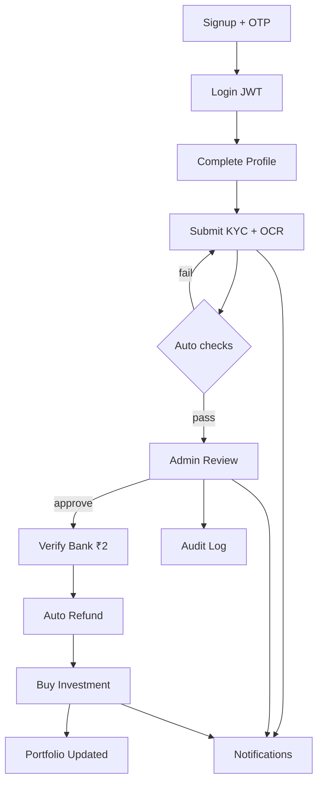

---

# 17. Mermaid Diagrams Index

| Diagram | Section |
|---------|---------|
| High-Level Architecture | §1.6 |
| Business Workflow | §2.4 |
| Current Component Map | §3.1 |
| Future Microservices | §3.2 |
| Signup Sequence | §5.2 |
| Signin Sequence | §5.3 |
| JWT Validation | §5.5 |
| Profile Flow | §6.7 |
| KYC Full Flow | §7.7 |
| OCR Sequence | §8.8 |
| Banking Verification | §9.7 |
| Investment Purchase | §10.9 |
| Future Notifications Kafka | §11.5 |
| Audit Approve Sequence | §12.3 |
| Hybrid Database | §13.1 |
| API Lifecycle | §14.4 |
| Module Interaction | §15.1 |
| End-to-End Journey | §16.2 |

---

# 18. Sequence Diagrams Index

| Flow | Section |
|------|---------|
| Signup (OTP + account creation) | §5.2 |
| Signin (email + password) | §5.3 |
| Phone OTP (send + verify) | §5.2 (embedded in signup) |
| JWT validation on protected route | §5.5 |
| KYC submission | §7.7 + §8.8 |
| OCR processing | §8.8 |
| Admin KYC approval | §12.3 |
| Banking verification + refund | §9.7 |
| Investment purchase | §10.9 |
| Notification creation | §11.2 (inline, synchronous) |
| Audit record on approve | §12.3 |

---

# 19. Current vs Future

## 19.1 Module Comparison Table

| Module | Current Implementation | Future Architecture |
|--------|------------------------|---------------------|
| **Gateway** | Single Express app on :4000 | Dedicated API Gateway proxy |
| **Auth** | `routes/authRoutes.js` in monolith | Auth Service :4001, own MongoDB DB |
| **Profile** | `routes/profileRoutes.js` in monolith | Profile Service :4002 |
| **KYC** | `backend/src/kyc/` | KYC Service :4003 + Kafka producer |
| **OCR** | `ocrService.js` inside KYC module | Part of KYC Service (or sidecar) |
| **Documents** | Multer → local disk | Document Service :4004 + S3/MinIO |
| **Banking** | `banking/` + Prisma | Banking Service :4005 + PostgreSQL |
| **Investments** | `investments/routes` | Investment Service :4006 |
| **Notifications** | Sync `notifyUser()` + MongoDB | Notification Service :4007 + Kafka consumer + email |
| **Audit** | Sync `audit()` write-only | Audit Service :4008 + Kafka consumer + read API |
| **Frontend** | Next.js + AuthContext + TanStack Query | Same; optional Redux; gateway proxy |
| **Messaging** | In-process function calls | Apache Kafka |
| **File storage** | `uploads/kyc/` | S3 / MinIO presigned URLs |
| **Deployment** | `pnpm run dev` | Docker Compose → Kubernetes |
| **Testing** | None in repo | Jest + Supertest per service |

## 19.2 Evolution Path per Module

Each `backend/src/{domain}/` folder is designed as an **extraction boundary**. Phase 10 moves the folder to `services/{domain}-service/`, adds Dockerfile, connects to Kafka where applicable, and registers routes on the API Gateway.

---

# 20. Developer Notes

## 20.1 Common Execution Paths

| Task | Command |
|------|---------|
| Install | `pnpm install` (root) |
| Dev (both) | `pnpm run dev` |
| Backend only | `pnpm --filter kyc-auth-backend dev` |
| Frontend only | `pnpm --filter kyc-auth-frontend dev` |
| Build frontend | `pnpm --filter kyc-auth-frontend build` |
| Seed admins | `pnpm --filter kyc-auth-backend seed:admin` |
| Seed KYC identities | `pnpm --filter kyc-auth-backend seed:kyc` |
| Banking migrations | `pnpm --filter kyc-auth-backend prisma:migrate` |

## 20.2 Important Middleware

| Middleware | File | When |
|------------|------|------|
| `requireAuth` | `middleware/auth.js` | All `/api/*` except public auth routes |
| `requireRole` | `middleware/auth.js` | KYC admin, AMC admin routes |
| `requireAdmin` | `middleware/auth.js` | Banking admin routes |
| `requireBankingConfigured` | `banking/middleware/requireBankingConfigured.js` | All `/api/banking/*` |
| `validate(schema)` | `middleware/validate.js` | Body validation |
| `sanitizeRequest` | `middleware/sanitize.js` | All requests |

## 20.3 Error Handling Flow

1. Controller/service throws or calls `next(error)`
2. Errors with `statusCode` → that HTTP status + message
3. Unhandled → 500 generic message
4. Frontend `getApiError()` extracts `message` or Zod `issues`

## 20.4 Environment Variables (Critical)

| Variable | Required | Module |
|----------|----------|--------|
| `MONGODB_URI` | Yes | All MongoDB |
| `JWT_SECRET` | Yes | Auth |
| `BANK_DATABASE_URL` | For banking | Banking |
| `OPENROUTER_API_KEY` | Optional | OCR LLM extraction |
| `TWILIO_*` | Optional | Real SMS OTP |
| `CLIENT_ORIGIN` | Recommended | CORS (include `:3000`) |
| `NEXT_PUBLIC_API_URL` | Frontend | Axios base URL |

## 20.5 Important Design Decisions

| Decision | Rationale |
|----------|-----------|
| Modular monolith first | MVP velocity; clear module boundaries for later extraction |
| Hybrid MongoDB + PostgreSQL | Document flexibility vs ledger ACID |
| Phone OTP on signup | Simulates mobile-first Indian fintech onboarding |
| DummyIdentity dataset | Deterministic demo KYC outcomes |
| Seeded demo OCR fallback | UX when Tesseract fails on poor images |
| Rs. 2 verification debit | Industry-standard penny-drop simulation |
| JWT in localStorage | Simplicity for demo; not production security model |
| Feature-based frontend | Scales with product modules; matches backend domains |

## 20.6 Known Limitations

| Area | Limitation |
|------|------------|
| Auth | No refresh token, no HttpOnly cookies, no password reset |
| KYC | No PAN checksum; auto-pass ignores OCR match for gate |
| Documents | Public static `/uploads` — no auth on file URLs |
| Notifications | No mark-read API; no email |
| Audit | Write-only; no admin query API |
| Admin KYC | No server pagination/filter |
| Investments | Market prices partly mocked client-side |
| Infrastructure | No Docker, Kafka, tests in repo |
| Supabase | Client lib present but unused |

## 20.7 Future Enhancements

> **Planned for Future Implementation** — see `IMPLEMENTATION-PLAN.md` Phases 9–10.

- Extract microservices with API Gateway
- Kafka event bus for notifications and audit
- S3/MinIO document storage with presigned URLs
- Jest + Supertest test suite + E2E script
- Docker Compose full stack
- Audit read API and admin UI
- Email notifications (nodemailer)
- Kubernetes deployment
- PAN checksum validation
- Secure document access (no public static serve)

---

## Document History

| Version | Date | Author | Changes |
|---------|------|--------|---------|
| 1.0 | 2026-06-26 | Architecture team | Initial comprehensive flow documentation |

---

*This document is derived from `PRD.md` v2.0, `IMPLEMENTATION-PLAN.md` v2.0, `TECH-STACK.md` v2.0, and verified against the repository at `backend/` and `frontend/`.*
